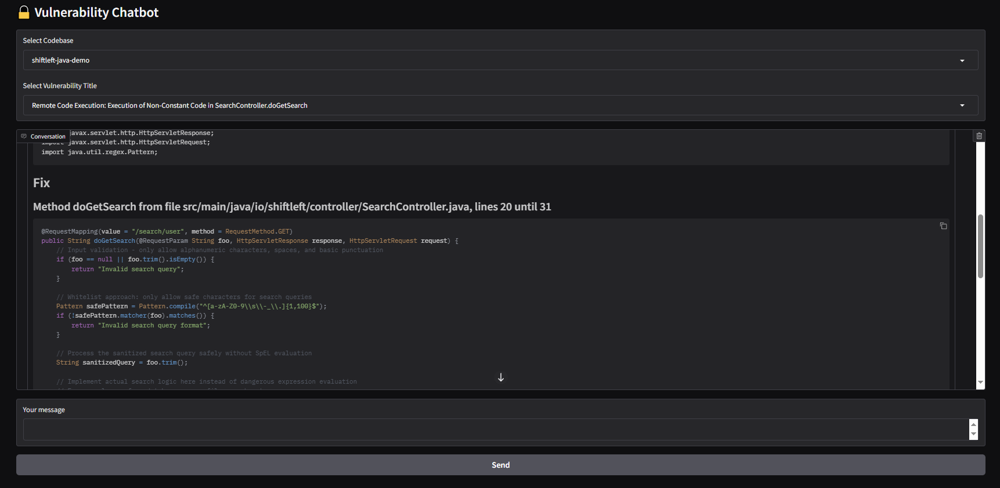

# README

A modular infrastructure project for deploying Python microservices (FastAPI, Gradio) using Docker, and AWS.

## View Project


---


## Project Structure

```
apps/
  management_api/      # FastAPI backend service
  web_app/             # Gradio frontend service
shared_lib/            # Shared Python code (logger, utilities)
docker-compose.yml     # Local dev orchestration
```

## Getting Started

### Prerequisites

- Python 3.13+ (recommended)
- Docker & Docker Compose
- AWS credentials (for infra deployment)
- [uv](https://github.com/astral-sh/uv) (for dependency management)

### Local Development

1. **Install dependencies for each app using uv:**
   ```powershell
   cd apps/management_api
   python -m venv .venv
   .\.venv\Scripts\activate
   pip install uv
   uv pip install -e .

   cd ../web_app
   python -m venv .venv
   .\.venv\Scripts\activate
   pip install uv
   uv pip install -e .
   ```
   *(This uses `pyproject.toml` for dependencies, not `requirements.txt`)*

2. **Run locally:**
   - Backend: `python main.py` (in `apps/management_api`)
   - Frontend: `python main.py` (in `apps/web_app`)

3. **Or use Docker Compose:**
   ```powershell
   docker-compose up --build
   ```
   This will start both services and network them together.

### Adding More Services

1. **Create a new folder in `apps/` (e.g., `my_service`).**
2. Add a `main.py`, `Dockerfile`, and `pyproject.toml`.
3. Use `shared_lib` for common code (import as `from shared_lib...`).
4. Update `docker-compose.yml` to add your new service.

### What is `shared_lib`?

- A directory for shared Python code (e.g., logging, utilities) used by all services.
- Example: `shared_lib/logger.py` sets up a consistent logger for all apps.

### What is uvicorn (uv)?

- `uvicorn` is an ASGI server used to run FastAPI apps.
- In `management_api`, it launches the backend API.
- In Docker, the CMD uses `uvicorn` to start the service.

### How to Use Environment Variables

- Services read config (host, port) from environment variables.
- In Docker Compose, these are set in the `environment:` section.
- For local dev, you can set them in your shell or a `.env` file.

### Deploying to AWS

- Use Pulumi scripts in `infra/` to provision ECR, EKS, and other resources.
- Run:
  ```powershell
  cd infra
  pulumi up
  ```
- This will detect all services in `apps/` and create AWS resources for each.

---

## Troubleshooting

- **ModuleNotFoundError for `shared_lib`:** Make sure your PYTHONPATH includes the project root or use the Docker setup.
- **Backend not reachable:** Ensure `BACKEND_HOST` is set correctly (`localhost` for local, `management_api` for Docker Compose).

---

## Contributing

- Add new services in `apps/`
- Share code in `shared_lib`
- Update infra as needed

---

